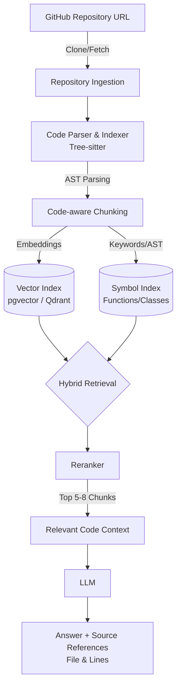

# Codebase Intelligence Platform


A production-grade Codebase RAG (Retrieval-Augmented Generation) and Intelligence Platform. Instead of answering questions against static, unstructured PDFs, this platform treats **any GitHub repository as its knowledge base**, transforming raw source code into an interactive, context-aware AI assistant.

By leveraging code-aware chunking (via Tree-sitter), hybrid retrieval (Semantic + Keyword), and LLM-powered synthesis, it provides highly accurate answers grounded in specific files and line numbers.

## 🎯 Vision & Architecture

Unlike basic RAG pipelines that blindly split text every 500 characters, this system intrinsically understands code structure (Functions, Classes, Methods, Interfaces).

### System Architecture



## 🚀 Production-Grade Features

- **Zero-Prep Knowledge Base:** Provide a GitHub URL; the system automatically clones, parses, and indexes the repository. No manual document preparation required.
- **Code-Aware Indexing:** Uses Tree-sitter to parse code into logical AST chunks (classes, methods, docstrings) rather than arbitrary text splits.
- **Hybrid Search & Reranking:** Combines vector similarity (semantic search) with exact symbol matching (keyword search), passing candidates through a cross-encoder reranker for maximum precision.
- **Source-Grounded Answers:** Hallucination mitigation by strictly citing the exact file path and line numbers (e.g., `auth/middleware.go L42-L71`) for every claim.
- **Repository-Level Understanding:** Capable of answering architectural queries ("How does a request travel through the system?", "Where are errors handled?").
- **Smart Caching & Incremental Indexing:** Hashes files to avoid re-embedding unchanged files during subsequent syncs.

## 🛠️ Technology Stack

- **Backend / API:** Python + FastAPI
- **Metadata & Persistence:** Supabase (Managed PostgreSQL) or Neon
- **Vector Search:** Pinecone / Qdrant Cloud / Supabase pgvector
- **Code Parsing:** Tree-sitter
- **Caching & Async Jobs:** Upstash (Serverless Redis) + Celery/RQ
- **Frontend / UI:** React + Next.js
- **Deployment:** Render / Railway (Backend) & Vercel (Frontend)

## 🛣️ Implementation Roadmap

This project is built progressively, starting from core capabilities and expanding into a production-ready infrastructure:

- [ ] **Phase 1: Foundation** - GitHub repo cloning → basic ingestion → simple semantic RAG.
- [ ] **Phase 2: Code Intelligence** - Tree-sitter integration for Code-aware chunking + precise source references in outputs.
- [ ] **Phase 3: Retrieval Pipeline** - Implementation of Hybrid retrieval + Reranking for high-fidelity context.
- [ ] **Phase 4: Architecture Comprehension** - Graph-based dependency understanding.
- [ ] **Phase 5: Performance** - Incremental indexing (hashing) + Redis caching.
- [ ] **Phase 6: Benchmarking** - Evaluation suite measuring retrieval accuracy, source hit rate, and latency.
- [ ] **Phase 7: User Interface** - Production-style Next.js UI interacting with FastAPI endpoints.
- [ ] **Phase 8: Cloud Deployment** - Deploying to managed platforms (Render/Railway & Vercel), CI/CD pipelines via GitHub Actions, observability, and security.

## 🔌 API Reference (Planned)

The backend exposes a clean REST interface:

```http
POST /api/v1/repositories            # Ingest a new repository via GitHub URL
POST /api/v1/repositories/{id}/index # Trigger re-index / sync
GET  /api/v1/repositories/{id}/status# Check indexing progress
GET  /api/v1/repositories/{id}/files # List indexed files
POST /api/v1/chat                    # Multi-turn chat with the codebase
```

## 🤝 Contributing

Contributions are welcome! Please read our [Code of Conduct](CODE_OF_CONDUCT.md) before submitting pull requests. 

1. Fork the repository
2. Create your feature branch (`git checkout -b feature/AmazingFeature`)
3. Commit your changes (`git commit -m 'Add some AmazingFeature'`)
4. Push to the branch (`git push origin feature/AmazingFeature`)
5. Open a Pull Request

## 📄 License

Distributed under the MIT License. See `LICENSE` for more information.
